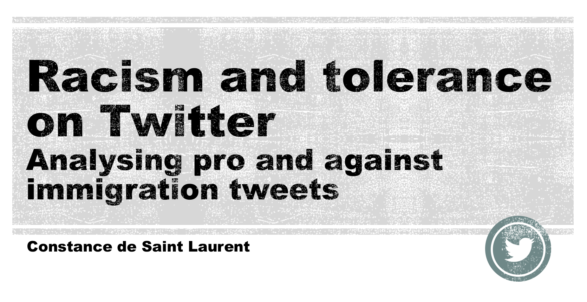
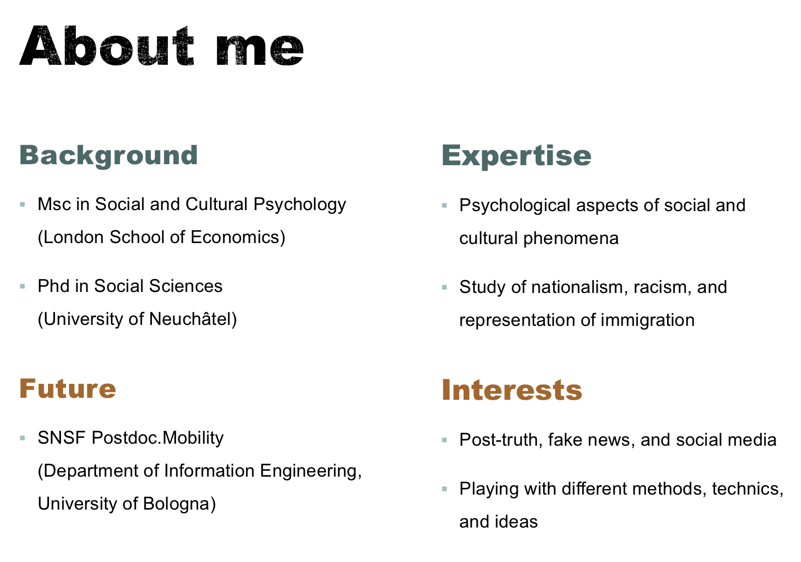
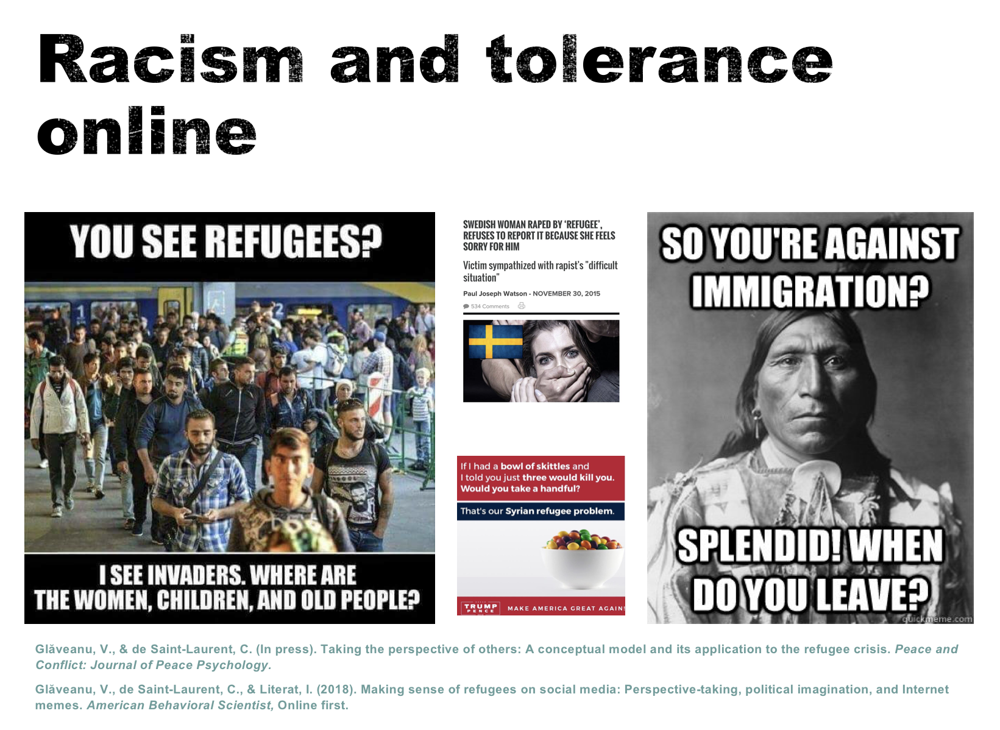
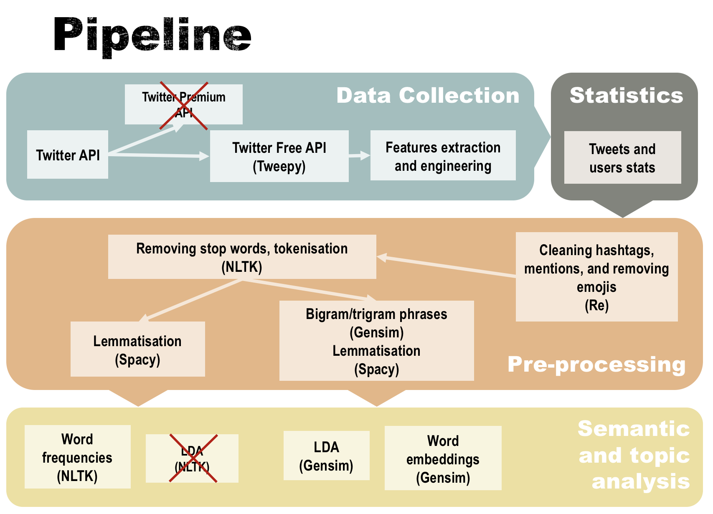
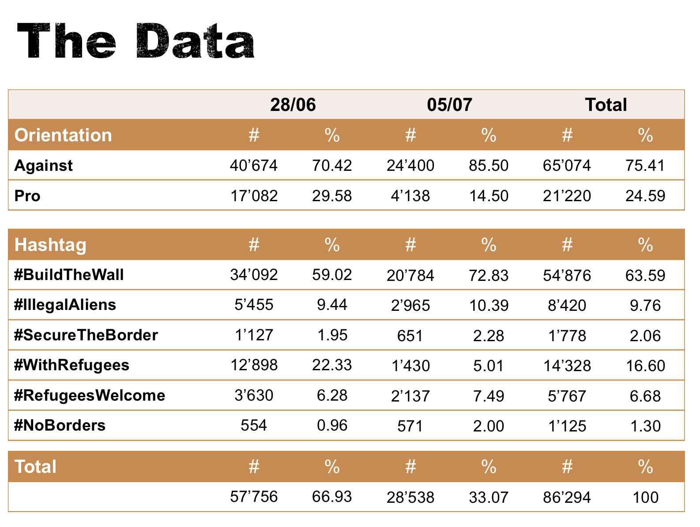
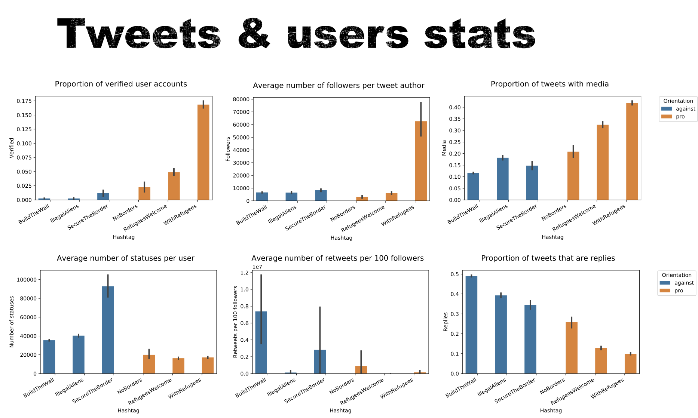
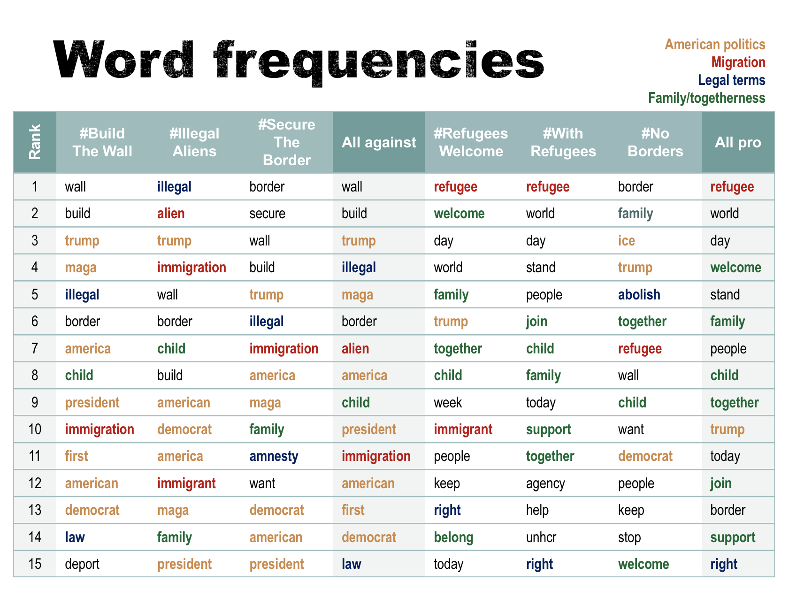
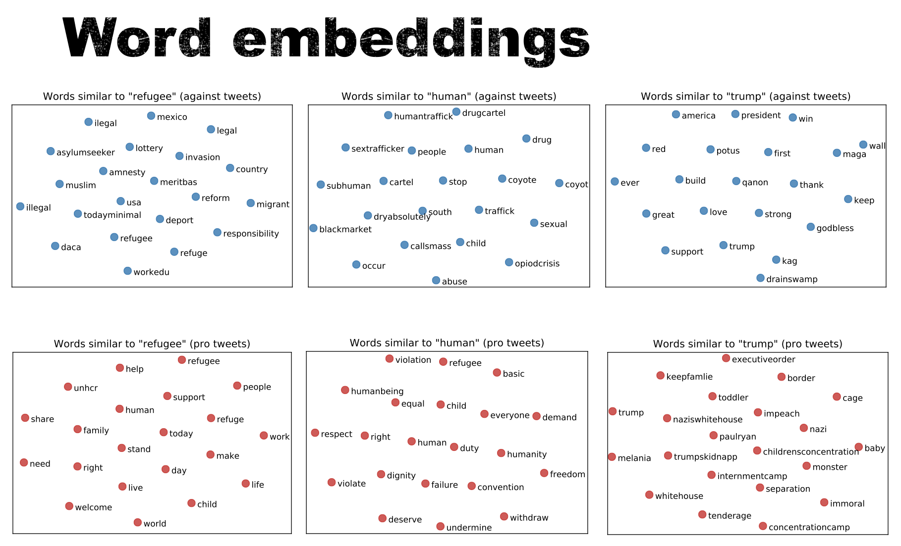
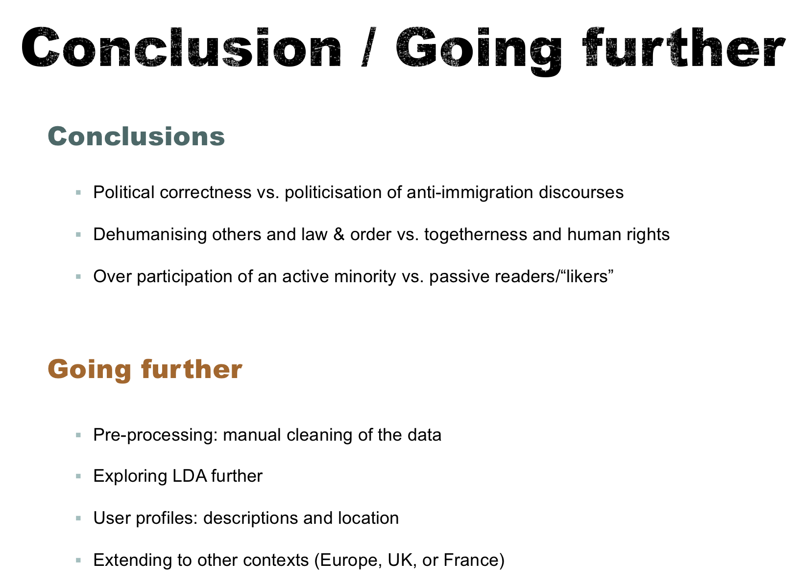
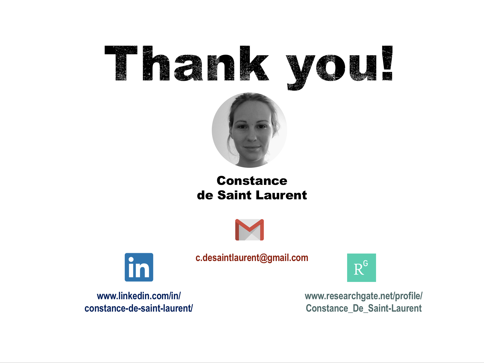

# Analysing pro and anti immigration tweets
Project in progress, looking at pro and anti immigration tweets
The first part was done as my capstone project for the Propulsion Academy Data Science Bootcamp, and is presented below
The project is currently being developed further as part of a study done with Vlad Glaveanu and Claude Chaudet,
both researchers at Webster University Geneva.

## Propulsion Capstone project presentation

This is a summary of the presentation I gave in July 2018 in Zurich at the end of the
Propulsion Academy Data Science Bootcamp

 

The main aim of this project was to analyse pro and anti immigration tweets using NLP

First, a bit on my background. I am a social scientist, trained at the London School of Economics in the UK,
and in Neuchâtel, where I finished my PhD in January 2018.

My expertise is in social psychology, that is the psychological aspects of social and cultural phenomena.
More specifically, I have studied nationalism, racism, and representations of immigration.

I am, since August 2018, a post-doctoral researcher for the Swiss National Foundation, based at the University of Bologna.
My main work focuses on post-truth politics, fake news, and social media, as well as how to use the tools of
data science in psychology.

This present project was an occasion to start doing just that.

Why racism online? Clearly, this is an increasingly visible and important topic, especially in discussions around
social media. But it also has real political consequences.

For instance image in the middle, with the bowl of Skittles, started as meme on Reddit (that we studied with a colleague
in the papers mentioned below it), and ended up as an official poster for the Trump campaign. In that particular area,
Twitter has played an important role as well, and so I decided to have a look at what where the anti and pro immigration
discourses there.

The image above is a summary of the process I followed. This very schematic, and only mentions a couple of dead ends
by crossing them over in red, although as you can imagine the process was much less linear than that.

I used twitter's free API to collect the tweets, which gives you 7 days of tweets. I had access to the premium API,
but it is unstable with Python and was too unreliable (it would work on some occasions, but not others).

I then extracted a few extra features, such as the number of mentions or hashtags in a tweet, or whether it contains
external media.

The next step, pre-processing the data, unsurprisingly took the longest, and is still in progress (in particular to
correct spelling mistakes). The long step there was extracting the content of the hashtags. Many studies using twitter
just remove them, but here they carried a lot of meaning.

Finally, I used some semantic and topic analysis: word frequencies, LDA, and word embeddings. LDA performed poorly,
particularly with NLTK, but also with Gensim. I am still trying to find a solution for this, but LDA is not very
adapted to Twitter data. The work around that have been found so far don't make sense in this specific context, so it
is for now unsolved.

Below I present some of the stats, word frequencies, and word embeddings.

This is the data that was collected. I focused on 6 hashtags, 3 pro immigration and 3 anti. These were chosen because
using them quite unequivocally showed what side of the debate the person was on, and because in this category, they were
the most frequently used at the time the first data set was collected.

These were collected in 2 batches, covering a 2 weeks period. It amounts to around 86'000 tweets, with about 75% anti
and 25% pro. It was very difficult to equilibrate the tweets, in large part because anti immigration hashtags
attract more users than the pro immigration ones.

All the analyses presented below were carried out on both batches at once. Analyses comparing different time periods
will be carried out later, after new batches are collected in August and September.

Who tweets what around immigration online? Unsurprisingly, very different people tweet on each side.

Pro immigration tweets tend to come from more official, verified accounts, especially for the most popular hashtag.
They have more followers, and they tend to use more images and videos. It supports the idea that these are more official
tweets that tend to carry a specific message.

Anti immigration tweets come from very active users, who post a lot. They get more retweets when compared to their number
of followers, and they are more often replies to other users (they also use mentions more).

Globally, it seems that pro immigration tweets come from official and popular accounts that are passively followed, and
anti immigration tweets come from active users who interact a lot with each other. This gives the impression that
you have 'politically correct' accounts on one side, and the 'real' users on the other. But let's look at the content.

Looking at the word frequencies, you get a different picture.

On the anti immigration side, there are lots of words related to Trump and American politics (in orange), to immigration
(in red), and to the legal system (in blue).

On the other side, there is a lot more words related to families and togetherness (in green), which makes sense given
that the data was collected around the period of the family separation scandal. You can also see that the legal vocabulary,
on that side, is about rights.

Globally, thus, it looks like the anti immigration side is much more politicised than the pro immigration side, that
refers mainly to general principles.

Let's look at the latent meanings of a few words, using word embeddings.

Looking at the word 'refugee', you can see that the anti immigration tweets associate it with 'invasion', 'illegal', and
'deport', and at best 'responsibility'. Pro immigration tweets use more positive words, like 'support', 'help', or 'right'.

Looking at the word 'human', it is on top associated with 'trafficking', 'subhuman', and no words related to immigrants
appear. At the bottom it is associated with 'rights', 'dignity', and 'refugee'. The word 'people' showed similar patterns.

Taken together, you can see that on one side you have discourses that see refugees as a burden that needs to be deported
(and potentially as subhuman), while on the other side they are seen as human beings whose rights should be supported.

Finally, the most polarising word I found was 'Trump', defined on one side as 'great', 'loved', and 'strong', and on the
other as a 'nazi' 'toddler' who should be 'impeached'.

This shows how politicised the issue actually is, especially around anti immigration figures.

A few words of conclusion.
Pro immigration discourses are often accused online of being politically correct, but it seems here that anti discourses
are even more politicised.
It also appears that anti immigration tweets tend to dehumanise others in the name of the law, while others promote
togetherness and human rights. So perhaps it's good to be politically correct ;)
Finally, you can see an over participation of an active minority, in contrast with passive users. So if you don't like the
current discourses on immigration, go online and tweet and retweet!
The section on going further above dates from the presentation in July and has changed quite a bit. What I am working on
now is:
- Cleaning up the data further, including correcting spelling mistakes (using text blob)
- Collecting more data, in August and September
- Detecting fake users, to separate the data from bots and analyse their effect
- Improving topic modelling, by experimenting further both with LDA and by using clustering methods (k-means and hierachical
clustering using tf-idf to vectorise the tweets)
I will post the new results here when they are ready.

## To contact me or follow my work:
c.desaintlaurent@gmail.com

www.linkedin.com/in/constance-de-saint-laurent/

www.researchgate.net/profile/Constance_De_Saint-Laurent

